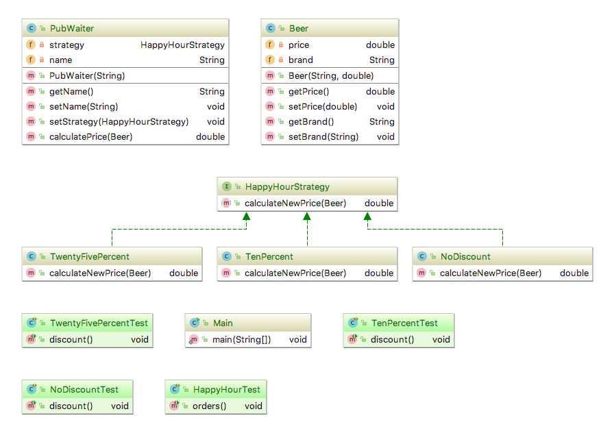

# ISI 3 TP 2: Design Pattern Strategy

Philippe Charrière :octocat: [@k33g](https://github.com/k33g)

:warning: Si vous avez une question, créez une issue dams votre projet et notifiez moi avec [@k33g](https://github.com/k33g)

> Le rapport est à saisir dans le ficher [RAPPORT.md](RAPPORT.md) en utilisant le [formalisme MarkDown](https://guides.github.com/features/mastering-markdown/)


## Exercice 0

### Faites une calculette

- codez une classe `Calculator.java` (cf. projet `/calculator`)
- ajoutez l'addition
- ajoutez la soustraction
- faites une classe `Main.java` qui va "utiliser" `Calculator.java`
- lancez un build: `mvn compile assembly:single`
- exécutez `java -jar calculator.1.0-SNAPSHOT.jar`
- ajoutez la multiplication
- ajoutez la division

### Discutons

- présentez votre solution
- conclusion(s) ?

## Rappel: le pattern Strategy

*Le pattern Strategy a pour objectif d'adapter le comportement et les algorithmes d'un objet en fonction d'un besoin sans changer les interactions de cet objet avec les clients*.


- la **stratégie**, c'est l'interface qui va définir la(les) méthode(s) des stratégies(options) que l'on va implémenter
- les **stratégies**, *(les opérations de la calculette par exemple)* vont implémenter l'interface **stratégie**
- le **contexte**, c'est la classe qui va utiliser les stratégies pour faire toujours la même action mais avec un résultat différent à chaque fois (par exemple notre classe `Calculator` qui va utiliser des opérations)

> autre exemple: modes de transport


## Exercice 1

> Comment ajouter des opérations à la classe `Calculator` sans être obligé de la modifier à chaque fois?

- re-faites la calculette en utilisant le pattern **Strategy**

### Discutons

- présentez votre solution
- conclusion(s) ?

## Exercice 2

### Happy Hour

**Enoncé/contexte**: modélisez le concept d'happy hour dans un pub. Le serveur sert des bières sur lesquelles il peut appliquer des réductions.
- le serveur est le contexte
- les réductions sont les stratégies

**À faire**: dans le projet `/beers`
- ajoutez le code nécessaire pour que les tests fonctionnent (lancez `mvn test`)
- ajoutez une réduction de 50%
- ajoutez et modifiez les tests nécessaires



## Exercice 3

### Logo (Turtle)

Le [Logo](https://en.wikipedia.org/wiki/Logo_(programming_language)) est un langage éducatif (créé en 1967) destiné à apprendre des notions de programmation aux enfants en faisant déplacer un curseur (turtle) sur l'écran avec des commandes simples (droite, gauche, ...).

**À faire**: Utilisez le pattern **Strategy** pour coder un "mini" Logo:

```java
Position startPosition = new Position(5,5);
Right moveToRight = new Right();
Left moveLeft = new Left();
Up moveUp = new Up();
Down moveDown = new Down();

Turtle turtle = new Turtle("O");

turtle
    .setStrategy(startPosition).move()
    .setStrategy(moveToRight).move().move().move()
    .setStrategy(moveUp).move().move()
    .setStrategy(moveLeft).move().move().move()
    .setStrategy(moveDown).move().move();
```

Vous devriez obtenir ceci comme rendu:

```shell
    OOOO
    O  O
    OOOO
```

#### À savoir

Pour positionner le curseur dans un terminal:

```java
// set the cursor position to row 5 and column 10
char escapeCode = 0x1B;
System.out.print(String.format("%c[;%d;%df",escapeCode,5, 10));
```

**Utilisez** le projet `/logo`

## Ressources

- https://sourcemaking.com/design_patterns/strategy
- https://dzone.com/articles/design-patterns-strategy


